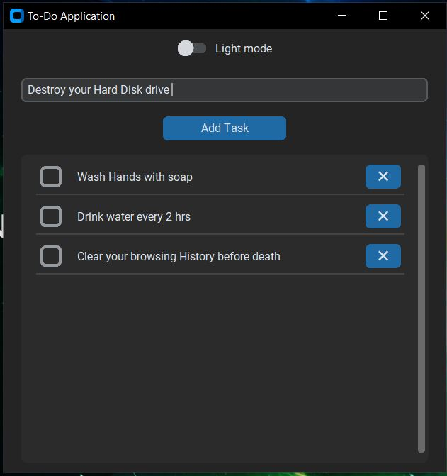
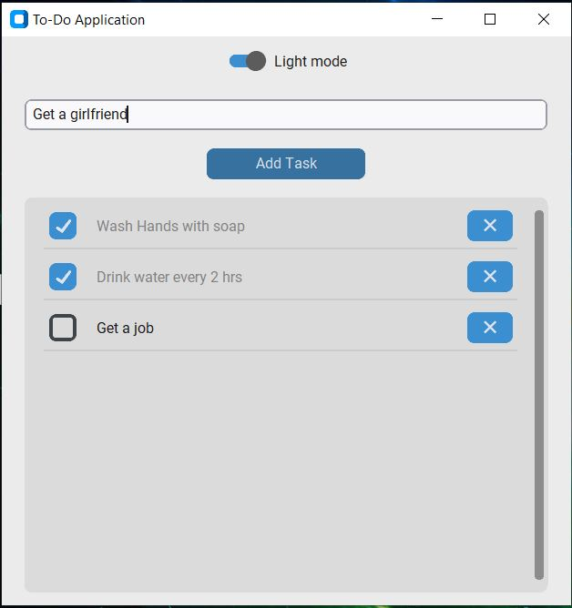

# ✅ To-Do Application

A simple and elegant **To-Do List App** built with **Python**, **CustomTkinter**, and **SQLite**.  
Supports light/dark mode, persistent tasks, and intuitive task management.

---

## 📦 Features

- 📝 Add new tasks with a click.
- ✅ Mark tasks as completed.
- 🗑️ Delete completed tasks.
- 🌙 Dark and light theme toggle.
- 💾 Saves tasks locally in SQLite database.
- 📁 One-file EXE available (via PyInstaller).
- 📌 Minimal, responsive UI using `customtkinter`.

---

## 🛠️ Tech Stack

- **Language**: Python 3
- **GUI**: [CustomTkinter](https://github.com/TomSchimansky/CustomTkinter)
- **Database**: SQLite

---

## 🚀 Getting Started

### 🔧 1. Clone the Repository

```bash
    git clone https://github.com/yourusername/todo-app.git
    cd todo-app
```

### 📦 2. Install Dependencies
```bash
  pip install customtkinter
```

### ▶️ 3. Run the App
```bash
  python main.py
```
---
## 📂 Project Structure

```css
To-do-app/
├── main.py               # Main GUI file
├── database.py           # Handles DB logic
├── db_creater.py         # Initializes table if needed
├── icon.ico              # App icon
├── database.db           # Local SQLite database
├── README.md             # Project documentation
└── assets/
    └── screenshot.png    # Optional app preview
```
---
## 📸 Screenshot

- **Dark mode**



- **Light mode**


---
## 📃 License
This project is free to modify and use.

---
## 🧑‍💻 Author
**Kashi Nath Chourasia**  
📧 [kashi533864@gmail.com](mailto:kashi533864@gmail.com)  
[🔗 LinkedIn](https://www.linkedin.com/in/kashi-nath-chourasia-42a39525a)